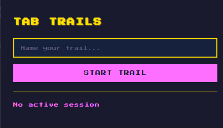
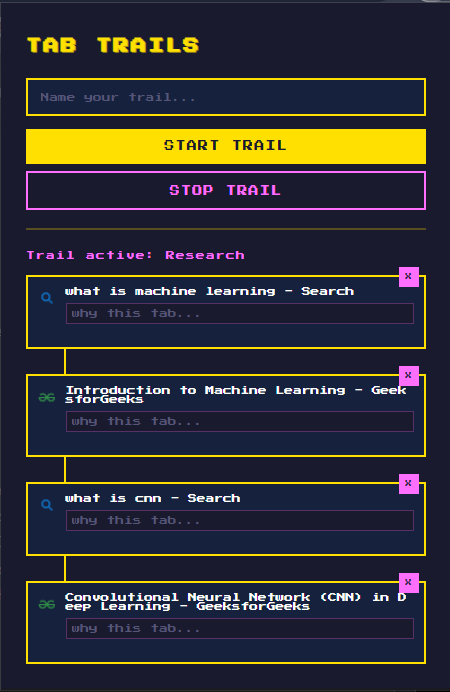
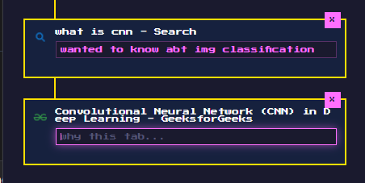

# Tab Trails

A pixel-themed Chrome extension that helps students and researchers track their browsing sessions as a visual trail.

## Features

- **Session Tracking**: Start a named research session called a "Trail".
- **Automatic Capture**: Automatically records every tab you open during an active session.
- **Visual Timeline**: Displays tabs as an intuitive vertical timeline directly inside the extension popup.
- **Notes & Annotations**: Add custom notes to each tab to record context and prevent rabbithole amnesia.
- **Management**: Easily delete unneeded tabs or stop your trail when finished.

---

## Extension Preview

|            Active Trail View             |             Adding Notes             |
| :--------------------------------------: | :----------------------------------: |
|  |  |

---

## Installation

1. Clone or download this repository to your local machine.
2. Open Google Chrome and navigate to `chrome://extensions`.
3. Enable **Developer Mode** using the toggle switch in the top-right corner.
4. Click the **Load Unpacked** button in the top-left.
5. Select the root folder containing the extension files (`manifest.json`).

---

## Tech Stack

- **Frontend**: HTML, CSS, JavaScript
- **Platform**: Chrome Extensions API (Manifest V3)

---

## Motivation

When diving deep into research, it is easy to accumulate dozens of open tabs with zero memory of why they were opened. **Tab Trails** was built to solve this exact problem, keeping track of your digital journey so your future self understands your past logic.

---

## Author

Made by **Siddarth K**
